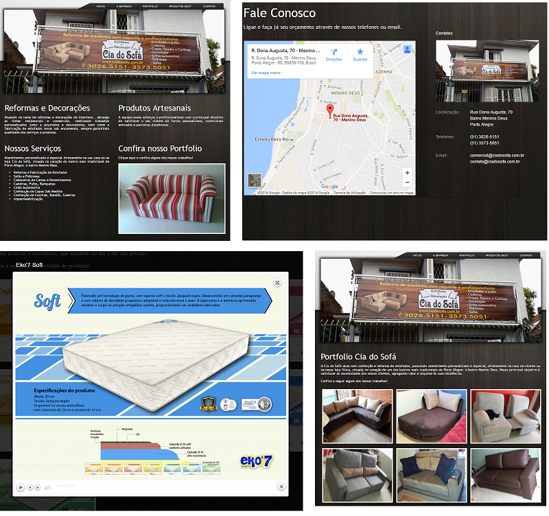

# COMPANHIA DO SOFA WEBSITE :star: :star: :star:

This project is a website developed for Companhia do Sofa, a local Brazilian company responsible to build and restore sofas.

Companhia do Sofa is a family business in the heart of Porto Alegre/Brazil. It’s director has been in the furniture industry for over 30 years, starting as a frame maker for a well known sofa manufacturer

## Companhia do Sofa services includes:

:white_check_mark: Sofa Repairs  
:white_check_mark: Chair Repairs 
:white_check_mark: Leather Repairs 
:white_check_mark: Replacement Covers / Foam 
:white_check_mark: Foam Cushion Replacement 
:white_check_mark: Sofa Cleaning 
:white_check_mark: Therapeutic Couches 
:white_check_mark: Dismantle and reassembly service 
:white_check_mark: Feet and castors replaced 

